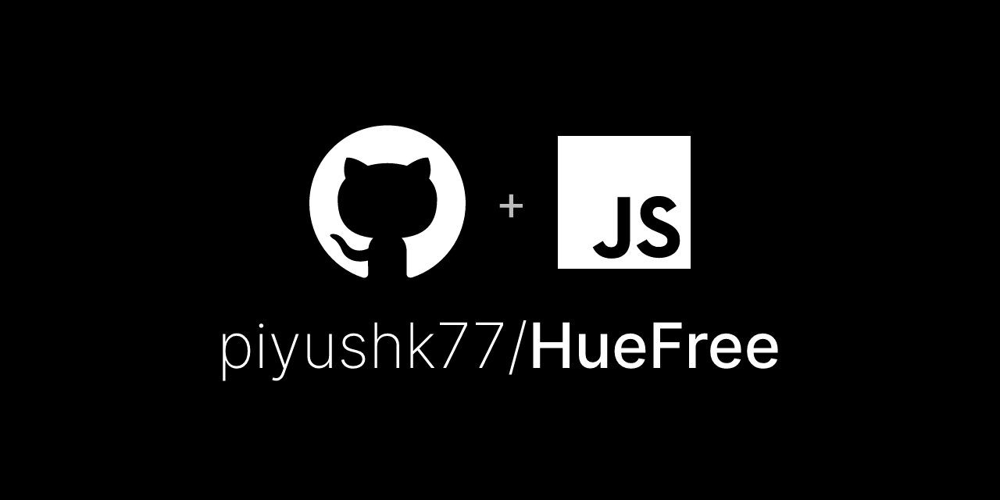

<h1 align="center" id="title">HueFree</h1>

<p align="center"></p>

<p id="description">HueFree is a comprehensive JavaScript library designed to assist developers in creating accessible color methods for users with color blindness. It provides a set of functions that enable manipulation and transformation of colors and DOM elements to enhance visibility and usability for color blind individuals. The library includes modules for handling color conversion linearization and vision simulation making it a valuable tool for creating inclusive web applications and visual content.</p>

  
<h2>Features</h2>

Here're some of the project's best features:

<h2>Installation Steps:</h2>

<p>1. Using npm (Node.js Environment) If you're using Node.js for your project: Install HueFree via npm:</p>

```
npm install @your-username/huefree
```

<p>2. Import HueFree into your project:</p>

```
// ES6 import syntax import {     stringToRgb     rgbToString     linearize     deLinearize     colorTransform     getVisions     getVisionDetail     changeVision     changeVisionRecursive     getCustomVisions } from '@your-username/huefree';
```

<p>3. Using a Script Tag (Browser Environment). If you're working with plain HTML CSS and JavaScript: Download the latest version of my-library.js from the repository. Include my-library.js in your HTML file:</p>

```

```

<p>4. Access the library functions via the global myLibrary object:</p>

```
const {     stringToRgb     rgbToString     linearize     deLinearize     colorTransform     getVisions     getVisionDetail     changeVision     changeVisionRecursive     getCustomVisions } = myLibrary;
```

<h2>Contribution Guidelines:</h2>

Contribution Guidelines Thank you for considering contributing to HueFree! We welcome contributions from the community to help improve and expand the library. Please follow these guidelines to ensure a smooth and effective contribution process. How to Contribute Fork the Repository Fork the repository to your own GitHub account by clicking the "Fork" button on the top right of the repository page. Clone Your Fork Clone your forked repository to your local machine using: bash Copy code git clone https://github.com/your-username/huefree.git Create a Branch Create a new branch for your contribution: bash Copy code git checkout -b feature/your-feature-name Make Your Changes Make your changes to the codebase. Ensure your code follows the project's coding standards and conventions. Commit Your Changes Commit your changes with a descriptive commit message: bash Copy code git add . git commit -m "Add feature: description of your feature" Push Your Changes Push your changes to your forked repository: bash Copy code git push origin feature/your-feature-name Create a Pull Request Navigate to the original repository and click the "New Pull Request" button. Select your branch and submit your pull request with a detailed description of your changes. Code Style Follow the existing code style and formatting. Use meaningful variable and function names. Include comments and documentation where necessary. Reporting Issues If you find any bugs or have suggestions for improvements please open an issue on the GitHub repository. Provide detailed information about the issue or suggestion to help us understand and address it effectively. Testing Ensure your changes do not break existing functionality by running the existing tests. If you add new features include appropriate tests. Documentation Update the documentation if your changes affect the existing documentation or if you add new features. Ensure that the documentation is clear and concise.

  
  
<h2>Built with</h2>

Technologies used in the project:

*   JavaScript: The primary programming language used for developing the library.
*   Node.js: The runtime environment for executing JavaScript code server-side.
*   NPM: Node Package Manager used for managing project dependencies.

<h2>License:</h2>

This project is licensed under the GNU General Public License v3.0